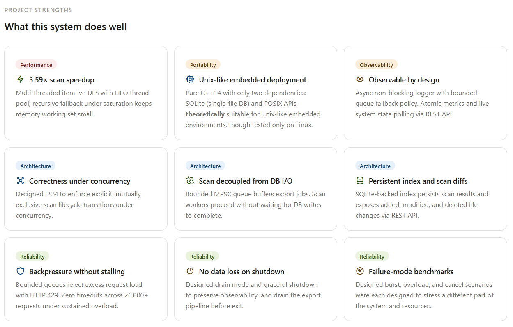
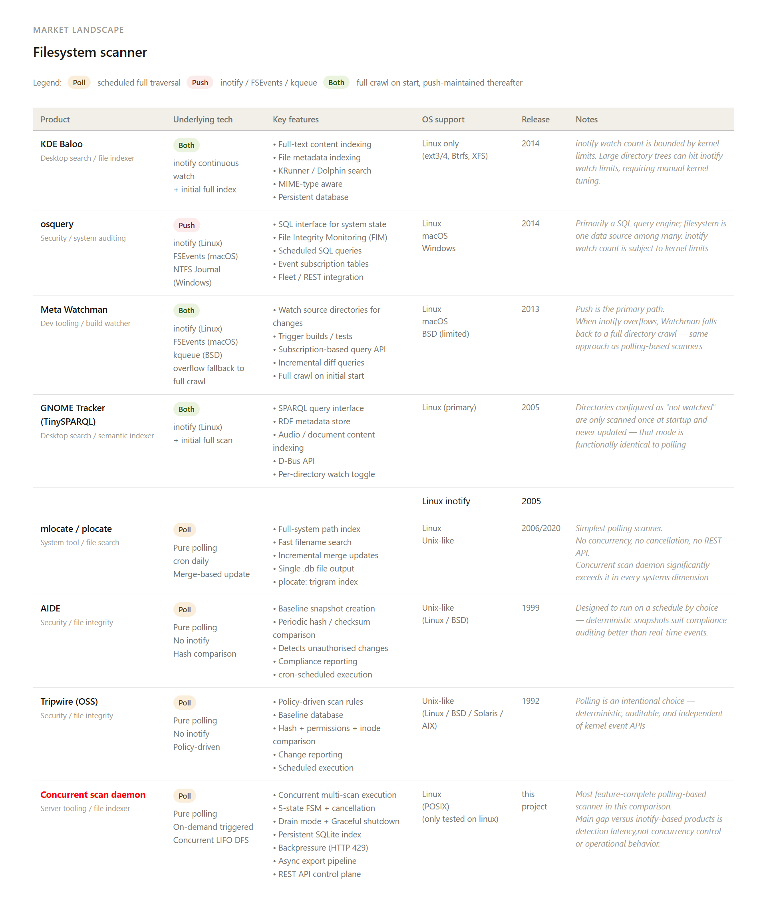

# File System Scanning Daemon
[](https://github.com/Cai-Ran/Parallel-Filesystem-Scanner-Daemon/actions/workflows/ci.yml)
[](https://github.com/Cai-Ran/Parallel-Filesystem-Scanner-Daemon/actions/workflows/sanitizers.yml)
[](https://github.com/Cai-Ran/Parallel-Filesystem-Scanner-Daemon/actions/workflows/clang-tidy.yml)
[](https://github.com/Cai-Ran/Parallel-Filesystem-Scanner-Daemon/actions/workflows/coverage.yml)
[](https://github.com/Cai-Ran/Parallel-Filesystem-Scanner-Daemon/actions/workflows/benchmark.yml)
[](https://github.com/Cai-Ran/Parallel-Filesystem-Scanner-Daemon/actions/workflows/codeql.yml)


> Scope note: current Sanitizers/Coverage focus on unit-tested concurrency modules (`job_queue`, `thread_pool`) and selected `utils`, not full daemon/API end-to-end paths.


## Table of Contents

- [Overview](#overview)
- [Quick Start](#quick-start)
- [System Architecture](#System-Architectur)
- [Scan Lifecycle Diagram](#Scan-Lifecycle-Diagram)
- [State Machine](#state-machine--polling-rules)
- [Directory Structure](#directory-structure)
- [Configuration](#configuration)
- [Benchmark Design](#benchmark-design)

---

## Overview


### Demo


If embedded playback is not supported on your Markdown viewer, [open the demo video](./assets/demo.mp4).

---

## Market Landscape


---
## Quick Start

### 1. Run on Linux

1. Build the project:

```bash
make
```

2. Start the daemon:

```bash
./service
```

3. Open your local browser:

```text
http://localhost:8080
```

### 2. Benchmark

1. Run the full benchmark suite:

```bash
make bench
```

2. Output is in benchmark/runs/ folder


---

## System Architecture

```text
+----------------------+          HTTP          +-------------------------------------+
| Browser / API Client | ---------------------> | HttpServer                          |
|                      |                        | - ThreadPool<int> (FIFO)            |
+----------------------+                        +------------------+------------------+
                                                                  |
                                                                  | calls Daemon API
                                                                  v
                                                     +------------+------------+
                                                     | Daemon                  |  <------------  SIGINT / SIGTERM
                                                     | - owns Scheduler        |
                                                     | - owns Manager          |
                                                     +------------+------------+
                                                                  |
                         +----------------------------------------+----------------------------------------+
                         |                                                                                 |
                         v                                                                                 v
           +-------------+--------------+                                                  +--------------+-------------+
           | Scheduler                  | <-------------- notify finished ---------------- | Manager                    |
           | - pending queue            |                                                  | - scan registry            |
           | - state map                |                                       ---------> | - callbacks to Scheduler   |
           +-------------+--------------+                                       |          +--------------+-------------+
                         |                                                      |                         |
                         | dispatch root                                        |                         | submit ScanData
                         v                                                      |                         v
           +-------------+--------------+                                       |          +--------------+-------------+
           | start_new_scan(scan_id)    | ---------------------------------------          | ThreadPool<ScanData>       |
           +----------------------------+                                                  | (LIFO)                     |
                                                                                           +--------------+-------------+
                                                                                                          |
                                                                                                          v
                                                                                           +--------------+-------------+
                                                                                           | MultiScanner               |
                                                                                           | - DFS-like traversal       |
                                                                                           | - builds ScanResult        |
                                                                                           +--------------+-------------+
                                                                                                          |
                                                                                                          | completed result
                                                                                                          v
                                                                                           +--------------+-------------+
                                                                                           | ExportManager              |
                                                                                           | - result_thread (MPSC)     |
                                                                                           |   batch upsert + finalize  |
                                                                                           +--------------+-------------+
                                                                                                          |
                                                                                                          v
                                                                                           +--------------+-------------+
                                                                                           | SQLite Database            |
                                                                                           | - index_table              |
                                                                                           | - index_current_table      |
                                                                                           | - scan_task_table          |
                                                                                           | - scan_diff_table          |
                                                                                           +----------------------------+
```

---

---

## State Machine & Polling Rules

```
 Scheduler                                  ExportManager
 poll: GET /state                           poll: GET /exporting
 ─────────────────────────────────────      ─────────────────────────────────
                              
 PENDING ──► RUNNING ────┐    polling           EXPORTING  
    │            │       │                         │
  cancel      cancel     |                         │
    │            │       │                         │
    ▼            ▼       ▼                         ▼
DROPPED✕   CANCELED✕   DONE✕                  EXPORTED✕   
                                    
                                                   
                                                

 ✕ = death state, stop polling
```

| State | Phase | Poll | Notes |
|---|---|---|---|
| `PENDING` `RUNNING` | Scheduler | `GET /state` | scan in progress |
| `DONE` `CANCELED` | Scheduler | ✕ stop | scan finished, export starting |
| `DROPPED` `FAILED` | Scheduler | ✕ stop  | — |
| `UNAVAILABLE` | ExportManager | ✕ no polling | `PENDING` `DROPPED` `FAILED` scans |
| `EXPORTING` | ExportManager | `GET /exporting` | writing results to SQLite DB |
| `EXPORTED` | ExportManager | ✕ stop  | user can fetch results via API |

---


## Scan Lifecycle Diagram

```text
            [Thread Pool]                     [Task Queue]                       [Thread Pool]       [Task Queue]
Client        HttpServer        Daemon          Scheduler         Manager         Scan Worker       ExportManager
  |               |               |                |                |                 |                  |
1 | POST /scan    |               |                |                |                 |                  |
  |-------------->|               |                |                |                 |                  |
2 |               | submit_scan() |                |                |                 |                  |
  |               |-------------->|                |                |                 |                  |
  |               |               | submit_scan_root(root): push_queue                |                  |
  |               |               |--------------->|                |                 |                  |
3a|<--------------| return HTTP 200                                 |                 |                  |
3b|<--------------| return HTTP 429               pending queue full|                 |                  |
  |               |               |                |                |                 |                  |
4 |               |               |                |start_new_scan(scan_id, root)     |                  |               
  |               |               |                |--------------->|                 |                  |
  |               |               |                |                | submit root job |                  |
5a|               |               |                |                |---------------->| Enqueue          |
  |               |               |                |                |                 |                  |
5b|               |               |reject run scan |<-------------- |<----------------| QueueFull        |

  |=============================== DONE flow =========================================|                  |
6 |               |               |                |                |<----------------| task_on_job_finish
7 |               |           notify_scan_finished |<---------------|                 |                  |
8 |               |               |                |                |------------------------------->    |
9 |               |               |                |                | push_queue(result)                 |

  |========================== Cancel A: PENDING -> DROPPED ===========================|                  |
c1| POST /cancel?id=...           |                |                |                 |                  |
  |-------------->|               |                |                |                 |                  |
c2|               | cancel_scan(id)                |                |                 |                  |
  |               |-------------->|                |                |                 |                  |
c3|               |               | cancel(id)     |                |                 |                  |
  |               |               |--------------->| state: PENDING -> DROPPED        |                  |
c4|<--------------| return HTTP 200                |                |                 |                  |

  |========================== Cancel B: RUNNING/DISPATCHING -> CANCELED ==============|                  |
r1| POST /cancel?id=...           |                |                |                 |                  |
  |-------------->|               |                |                |                 |                  |
r2|               | cancel_scan(id)                |                |                 |                  |
  |               |-------------->|                |                |                 |                  |
r3|               |               | cancel(id)     |                |                 |                  |
  |               |               |--------------->| state: RUNNING/DISPATCHING -> CANCELED              |
r4|<--------------|  return HTTP 200               |                |                 |                  |
  |               |               |                |--------------->|cancel_scan(id)  |                  |
  |               |               |                |                |                 |                  |
  |               |               |                |                |---------------->| 
r6|               |               |                |                |<----------------| task_on_job_finish
r7|               |           notify_scan_finished |<---------------|                 |                  |
r8|               |               |                |                |----------------------------------->|
r9|               |               |                |                | push_queue({..., canceled=true})   |


```
------


## Directory Structure

```
Parallel-Filesystem-Scanner-Daemon/
├── src/
│   ├── main.cpp                  # Entry point
│   ├── common/                   # Shared data structures (FileEvent, ScanTaskRow, db_types)
│   ├── concurrency/              # ThreadPool, JobQueue templates
│   ├── daemon_system/            # Daemon, HttpServer, Scheduler
│   ├── scan_system/              # Manager, MultiScanner
│   ├── export_system/            # ExportManager
│   │   └── db_wrapper/           # SQLite layer (IndexWriter, IndexReader, ScanTable, ScanDiff)
│   └── utils/                    # Config, AsyncLogger, Metrics, Formater
├── web/                          # Frontend HTML/JS
├── tests/                        # Unit and integration tests
├── benchmark/                    # Performance benchmarking
├── db/                           # SQLite database files (created at build time)
├── log/                          # Runtime log files
├── config.ini                    # Runtime configuration
└── makefile                      # Build system
```

---

### Module Ownership Tree

```
main.cpp
└── Daemon
    ├── HttpServer       
    |   └── fd_pool:   ThreadPool<int>
    ├── Scheduler         
    └── Manager
        ├── MultiScanner
        ├── scan_pool: ThreadPool<ScanData>  
        └── ExportManager
              └─ result_thread  (JobQueue<FileEvent>  → batch upsert + finalize on sentinel)
              SQLite DB
```


## Configuration

`config.ini` sections and key parameters:

| Section | Key | Default | Description |
|---|---|---|---|
| `[daemon]` | `user_download_sec` | `60` | Grace period after shutdown for client downloads |
| `[httpserver]` | `server_port` | `8080` | Listening port |
| `[httpserver]` | `fd_pool_num_threads` | `16` | HTTP worker thread count |
| `[httpserver]` | `fd_queue_max_size` | `8` | HTTP request queue capacity |
| `[scheduler]` | `max_concurrent_scan` | `3` | Max simultaneous scans |
| `[scheduler]` | `queue_max_size` | `4` | Pending scan queue capacity |
| `[manager]` | `scan_pool_num_threads` | `4` | Scan worker thread count |
| `[manager]` | `scan_queue_max_size` | `1000` | Scan job queue capacity |
| `[asynclogger]` | `log_dir` | *(path)* | Directory for log files |
| `[asynclogger]` | `queue_max_size` | `8192` | Log queue capacity |
| `[export_manager]` | `que_size` | `524288` | Result write queue capacity |
| `[db]` | `db_path` | `./db/scan_database.db` | SQLite database file path |
| `[db]` | `batch_size` | `32768` | Max rows per SQLite write batch |
| `[db]` | `fsync` | `FALSE` | Enable fsync after each write batch |


## Benchmark Design

### Config

Each profile is described by three parameters: 
- `max_concurrent_scan`
- `scan_pool_num_threads`
- `fd_pool_num_threads` 


- **Baseline** (`1/1/16`): near single-threaded — one scan worker, one fd worker, one scan allowed at a time. Used as the reference point for speedup calculation.
- **`concurrent_current`**: the production-style config being tested, with asymmetric thread/concurrency settings.
- **`concurrent_2/3/4/5`**: symmetric scaling profiles where all three parameters are set to the same value for scan (e.g. `concurrent_3` = `3/3/16`). Used to observe how throughput and resource usage scale with worker count.

---

### Measured Metrics
- Latency:
  - scan scenarios: average and p95 from accepted `POST /scan` to terminal state `DONE`.
  - `cancel_flow`: average and p95 from accepted `POST /cancel` to terminal state (`CANCELED` or `DROPPED`).
- Throughput:
  - scan scenarios: completed (`DONE`) scans per minute.
  - `cancel_flow` scenario: terminal cancels (`CANCELED` + `DROPPED`) per minute.
- Scan total expected (entries):
  - Formula: `scan_total_expected_entries = done * scan_entries_per_root_expected`.
  - In this run, `scan_entries_per_root_expected=83365` (`dirs_per_root=1365` + `files_per_root=82000`) from fake dataset config.
  - `cancel_flow` uses the same formula and therefore is usually `0` because `done=0` under cancel-target scenarios.
- Backpressure: HTTP 429 count under overload.
- Timeout(-1): client did not receive response (network/transport level).
- Resource usage: process CPU (`avg`, `p95`) and RSS memory peak (MB).
- Per-profile/raw metrics are available in `results.json` for deeper analysis.

### Scenarios
1. `single_big_scan`: one large root scan.
- config in this run: `drop_caches_before_run=true` for `single_big_scan`.
- `single_big_scan` drops Linux page cache before each profile run to keep speedup comparisons closer to cold-cache conditions.
2. `burst_submit`: 12 threads concurrently fire 60 `POST /scan` requests in one shot, then wait for all accepted scans to reach a terminal state. Latency is measured from accepted `POST /scan` timestamp to terminal `DONE`.
3. `overload_queue`: 20 threads hammer `POST /scan` with no sleep for 20 seconds; request total is not fixed — it is determined by how fast the service accepts responses within the time window. Throughput is computed as `DONE` count per elapsed window.
4. `cancel_flow`: two-phase model. Phase 1 — 10 threads submit 40 `POST /scan`; once all submissions complete, immediately snapshot IDs still in `PENDING/RUNNING`. Phase 2 — sleep `cancel_delay_sec`, then 10 threads `POST /cancel` for every snapshotted ID. Cancel latency/throughput are measured from accepted `POST /cancel` to terminal `CANCELED/DROPPED`.
- config in this run: `cancel_delay_sec=1`.
- a larger `cancel_delay_sec` means more scans finish before the cancel arrives, increasing `409` conflict rate.

---

### Results
- System: `nproc=16`, `total_mem=7.57 GB`
- `scan_entries_per_root_expected=83365` (`dirs_per_root=1365` + `files_per_root=82000`)
- SQLite DB is deleted before each profile run to ensure a clean starting state.

#### single_big_scan — Speedup vs Baseline

Scenario goal: measure scan-path parallelization efficiency on one large root by comparing completion time against the single-thread baseline.

| Profile | latency (s) | Speedup |
|---|---:|---:|
| baseline_single | 0.5807 | 1.000x |
| concurrent_2 | 0.1916 | 3.031x |
| concurrent_3 | 0.1738 | 3.341x |
| concurrent_4 | 0.1713 | 3.390x |
| concurrent_5 | 0.1767 | 3.286x |
| concurrent_current | 0.1616 | 3.593x |

---

#### burst_submit — Done Rate (Effective Capacity Under Burst, 60 requests)

Scenario goal: test effective capacity and protection behavior under sudden burst traffic (fixed-count concurrent submit).

| Profile | Req Total | Reject 429 | Done | Done % | Throughput Scan (/min) | IO Elapsed(s) | IO Throughput (K*entry/sec) | Expect_Scanned Size (entries) | Latency Avg (s) | Latency P95 (s) | CPU_avg (%) | CPU_p95 (%) | RSS peak (MB) |
|---|---:|---:|---:|---:|---:|---:|---:|---:|---:|---:|---:|---:|---:|
| baseline_single | 60 | 55 | 5 | 8.3% | 103.767 | 6.8114 | 61.195 | 416825 | 1.5421 | 2.7395 | 101.62 | 242.42 | 49.05 |
| concurrent_2 | 60 | 54 | 6 | 10.0% | 241.093 | 8.8723 | 56.377 | 500190 | 0.8173 | 1.4177 | 95.08 | 290.91 | 101.79 |
| concurrent_3 | 60 | 53 | 7 | 11.7% | 230.880 | 10.0458 | 58.089 | 583555 | 0.9847 | 1.7300 | 109.97 | 350.00 | 113.01 |
| concurrent_4 | 60 | 52 | 8 | 13.3% | 70.732 | 16.4004 | 40.665 | 666920 | 2.6653 | 6.7759 | 139.09 | 436.36 | 127.49 |
| concurrent_5 | 60 | 51 | 9 | 15.0% | 43.091 | 23.6557 | 31.717 | 750285 | 3.6845 | 10.3969 | 151.21 | 470.59 | 128.77 |
| concurrent_current | 60 | 53 | 7 | 11.7% | 197.501 | 9.9669 | 58.550 | 583555 | 1.1851 | 2.0793 | 131.05 | 450.00 | 120.30 |

---

#### overload_queue — Throughput vs Resource Cost

Scenario goal: test stability under sustained pressure (time-window (20s) continuous submit), including whether the system rejects excess load instead of stalling.

| Profile | Req Total | Done | Reject 429 | Reject 409 | Timeout (-1) | Throughput Scan (/min) | IO Elapsed(s) | IO Throughput  (K*entry/sec) | Expect_Scanned Size (entries) | CPU_avg (%) | CPU_p95 (%) | RSS Peak (MB) |
|---|---:|---:|---:|---:|---:|---:|---:|---:|---:|---:|---:|---:|
| baseline_single | 29434 | 21 | 29408 | 5 | 0 | 47.145 | 36.7992 | 47.573 | 1750665 | 98.18 | 235.29 | 129.15 |
| concurrent_2 | 24210 | 19 | 24188 | 3 | 0 | 38.587 | 39.1593 | 40.449 | 1583935 | 112.31 | 285.18 | 132.69 |
| concurrent_3 | 22529 | 19 | 22509 | 1 | 0 | 31.277 | 47.4985 | 33.347 | 1583935 | 127.66 | 300.41 | 133.73 |
| concurrent_4 | 20780 | 18 | 20762 | 0 | 0 | 17.113 | 73.6064 | 20.386 | 1500570 | 129.75 | 206.88 | 133.31 |
| concurrent_5 | 13648 | 18 | 13629 | 1 | 0 | 15.157 | 85.1367 | 17.625 | 1500570 | 146.29 | 242.74 | 133.37 |
| concurrent_current | 25826 | 17 | 25806 | 3 | 0 | 21.081 | 59.0668 | 23.993 | 1417205 | 136.77 | 231.88 | 132.54 |

---

#### cancel_flow — Cancel Latency & Conflict Rate

Scenario method: two-phase model. 
- Phase 1 submits a batch of scans concurrently, then snapshots IDs still in `PENDING/RUNNING`
- Phase 2 waits `cancel_delay_sec` and sends `POST /cancel` for that snapshot. 
- This measures cancel latency and late-cancel conflict (`409`) when targets have already finished or left cancellable states before `POST /cancel`.

| Profile | Req Total | 409 | DROPPED | CANCELED | DONE | Throughput (/min) | Latency Avg (ms) | Latency P95 (ms) |
|---|---:|---:|---:|---:|---:|---:|---:|---:|
| baseline_single | 5 | 2 | 1 | 2 | 0 | 173.252 | 1.1 | 1.9 |
| concurrent_2 | 6 | 4 | 0 | 2 | 0 | 114.733 | 3.5 | 5.4 |
| concurrent_3 | 7 | 4 | 0 | 3 | 0 | 171.130 | 5.1 | 7.2 |
| concurrent_4 | 8 | 3 | 0 | 5 | 0 | 280.193 | 10.6 | 19.5 |
| concurrent_5 | 9 | 1 | 1 | 7 | 0 | 427.940 | 25.0 | 42.5 |
| concurrent_current | 7 | 3 | 1 | 3 | 0 | 228.348 | 3.8 | 6.2 |

---

## Analysis

### single_big_scan

All concurrent profiles deliver 3.0x–3.6x speedup over the baseline. All symmetric profiles land within a narrow 3.0x–3.4x band, with marginal improvement from `concurrency = 3` onward — suggesting scan workers begin competing for the same filesystem I/O bandwidth beyond 3 workers. 

### burst_submit

`Reject 429` is uniformly high, confirming backpressure is active across all profiles.

Effective capacity rises monotonically with thread count. IO elapsed grows in parallel, confirming write-path saturation: when more scan workers complete in parallel, DB write becomes the bottleneck.


### overload_queue

All profiles record `Timeout(-1)=0`, confirming the server sheds load immediately via `429` without stalling client connections.

Throughput decreases monotonically with concurrency. Under sustained overload the scheduler accepts a bounded number of scans in each window, but with more workers those scans generate a higher peak write load, `near single-thread` baseline single worker never overloads the DB write path and therefore sustains the highest throughput.

### cancel_flow

Cancel latency stays consistently low, confirming the cancel control plane is independent of the DB write path and unaffected by I/O saturation.

## Conclusion
- Parallel scan delivers 3.0x–3.6x speedup, with `current config` achieving the best single-scan result (3.593x).
- Under burst traffic, `concurrency=2`~`concurrency=3` are the practical sweet spot: highest scan throughput and lowest latency.
- Under sustained overload, near `single-thread` baseline outperforms all concurrent profiles in throughput because the single SQLite writer thread is the binding constraint — extra scan workers increase write contention faster than they increase completion rate.
- Cancel responsiveness is fast and independent of I/O load, confirming correct separation of the cancel control plane from the write path.
- `DB single write IO is the main bottleneck.`


## License
Copyright 2026 All rights reserved.  - see the [LICENSE](./LICENSE) file for details.
